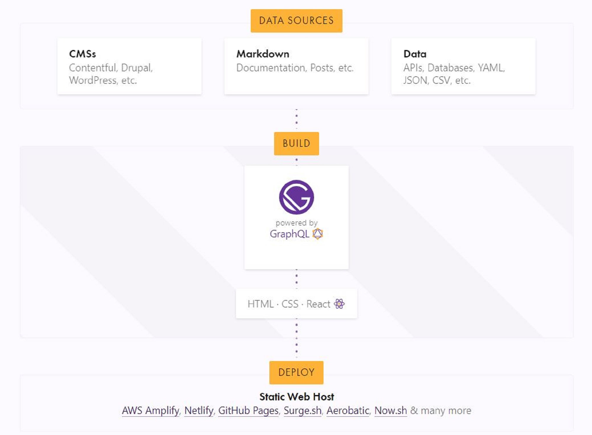

## What is Gatsby?

> Gatsby is a free and open source framework based on React that helps developers build blazing fast websites and apps

## How Gatsby works
[Pull data from anywhere]

## Ecosystem
`Plugins & Starters`

### Plugins
Plugins are packages that extend Gatsby sites. 
They can source content, transform data, and more!

[Browse Plugins](https://www.gatsbyjs.org/plugins/)

### Starters
Starters are Gatsby sites that are preconfigured for different use cases to give you a head start for your project.

[Browse Starters](https://www.gatsbyjs.org/starters/?v=2)
